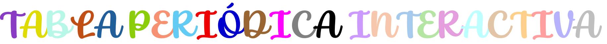
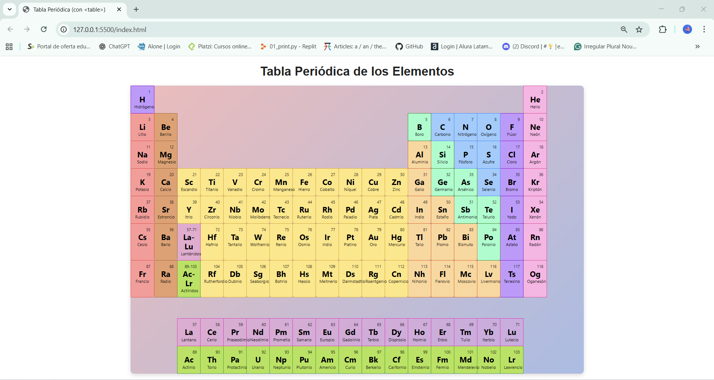

# <div align="center"></div>

<a name="indice"></a>
## 

1. [Descripción del trabajo](#descripcion-del-trabajo)  
2. [Objetivos de Aprendizaje](#objetivos-de-aprendizaje)
3. [Tecnologías usadas](#tecnologias-usadas)  
4. [Requisitos Técnicos](#requisitos-tecnicos)
5. [Resultado Final](#resultado-final)
6. [Recomendaciones](#recomendaciones)  
7. [Conclusiones](#conclusiones)  
8. [Desarrolladora](#desarrolladora)  

---

<a name="descripcion-del-trabajo"></a>
## 

Este proyecto consiste en la construcción de una **versión digital de la Tabla Periódica** utilizando únicamente etiquetas de **tablas HTML**. El reto busca aplicar una estructura semántica correcta, estilos personalizados y un poco de interactividad con CSS.  

La Tabla Periódica es el ejemplo perfecto de datos tabulares, y este reto demuestra cómo **HTML + CSS** pueden organizar información compleja de manera clara, elegante y dinámica.  

[⬆️ Volver al índice](#indice)

---

<a name="objetivos-de-aprendizaje"></a>
## 

- Estructurar datos complejos usando las etiquetas `<table>`, `<tr>`, `<th>` y `<td>`.  
- Manejar **celdas vacías** y expansiones de columnas (`colspan`) para crear layouts complejos.  
- Aplicar **estilos dinámicos** basados en categorías de elementos químicos.  
- Añadir **interactividad visual** utilizando pseudo-clases de CSS (`:hover`).  

[⬆️ Volver al índice](#indice)

---

<a name="tecnologias-usadas"></a>
## 

- **HTML5** → estructura de la tabla y contenido de cada elemento.  
- **CSS3** → estilos, categorías por colores, y efectos dinámicos.  
- **Git & GitHub** → control de versiones y despliegue del proyecto.  

[⬆️ Volver al índice](#indice)

---

<a name="requisitos-tecnicos"></a>
## 

### 1️⃣ Estructura del HTML (`index.html`)  
- Toda la tabla está contenida en un `<table>`.  
- Se crean filas con `<tr>` y celdas con `<td>`.  
- Cada elemento tiene su celda propia, mientras que los espacios vacíos se representan con `<td></td>`.  
- Ejemplo de la primera fila:  
  - 1 celda para el **Hidrógeno**  
  - 16 celdas vacías  
  - 1 celda para el **Helio**  

Dentro de cada celda de elemento se muestra:  
- Número atómico  
- Símbolo químico  
- Nombre del elemento  

---

### 2️⃣ Estilizado con CSS (`style.css`)  
- Bordes, tamaños y alineación configurados para una presentación clara.  

```css
.table {
  border-collapse: collapse;
  width: 100%;
}

.element {
  border: 1px solid #ccc;
  padding: 10px;
  text-align: center;
  width: 5.5%; /* 100% / 18 columnas aprox */
}
```

- Colores por categorías químicas (ej: `.gas-noble`, `.alcalino`, `.metal-transicion`).
- Celdas vacías sin color.

---

### 3️⃣ Interactividad con `:hover`

Se aplica un efecto visual elegante cuando el usuario pasa el cursor sobre los elementos:

```css
.element:hover {
  transform: scale(1.1);
  box-shadow: 0 0 10px rgba(0,0,0,0.5);
  background-color: #333;
  color: white;
}
```

[⬆️ Volver al índice](#indice)

---
<a name="resultado-final"></a>
## 

<div align="center"></div>

[⬆️ Volver al índice](#indice)

---

<a name="recomendaciones"></a>
## 

- Usar un navegador actualizado para visualizar correctamente el diseño.  
- Mantener el código ordenado y comentado para futuras mejoras.  
- Se sugiere explorar la posibilidad de agregar **JavaScript** para hacerlo interactivo (por ejemplo: mostrar información de cada elemento al pasar el cursor).  

[⬆️ Volver al índice](#indice)

---

<a name="conclusiones"></a>
## 

Este reto permitió aplicar de manera práctica los conocimientos de HTML y CSS en la construcción de una tabla compleja como la tabla periódica, gracias a la estructura semántica con `<table>`, `<tr>`, `<th>` y `<td>`, fue posible organizar los elementos químicos y espacios vacíos de forma ordenada, representando fielmente la distribución real de la tabla periódica. El trabajo con estilos CSS para diferenciar categorías de elementos y aplicar efectos de interactividad reforzó la importancia de combinar estructura semántica y diseño visual en un mismo proyecto.

Durante el desarrollo del proyecto, el uso de Git y GitHub fue fundamental para mantener un control de versiones claro y un flujo de trabajo organizado, estas herramientas facilitaron el guardado de avances incrementales, la posibilidad de revertir cambios en caso de errores, y mantener un historial completo del desarrollo. En un entorno académico y de colaboración, este tipo de control de versiones resulta clave para simular las mejores prácticas de la industria del software y acostumbrarse a trabajar de manera profesional desde la formación universitaria.

El proyecto no solo cumplió con los objetivos planteados, sino que también establece una base sólida para futuras mejoras y funcionalidades. La tabla periódica digital desarrollada puede evolucionar incorporando más estilos, funcionalidades interactivas o incluso información adicional de cada elemento, convirtiéndose en una herramienta educativa digital, de esta manera, lo que comenzó como un ejercicio académico puede llegar a ser un recurso útil para estudiantes y docentes de ciencias, demostrando el potencial de integrar programación y educación

[⬆️ Volver al índice](#indice)

---

<a name="desarrolladora"></a>
## 

Este proyecto fue desarrollado por Johana Jazmín Saavedra, estudiante de cuarto semestre en Técnica profesional en programación de aplicaciones de software de la Fundación Universitaria Compensar. Con una participación activa en la creación y desarrollo del proyecto.

<div align="center">
  
  <br>
  <strong>Johana Jazmín Saavedra</strong>
</div>

[⬆️ Volver al índice](#indice)
